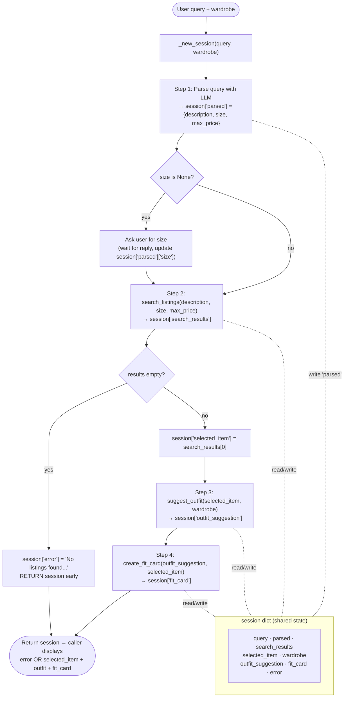

# FitFindr — planning.md

> Complete this document before writing any implementation code.
> Your spec and agent diagram are what you'll use to direct AI tools (Claude, Copilot, etc.) to generate your implementation — the more specific they are, the more useful the generated code will be.
> Your planning.md will be reviewed as part of your submission.
> Update it before starting any stretch features.

---

## Tools

List every tool your agent will use. For each tool, fill in all four fields.
You must have at least 3 tools. The three required tools are listed — add any additional tools below them.

### Tool 1: search_listings

**What it does:**
Searches the 40-item mock listings dataset for secondhand clothing that matches a keyword description, optional size, and optional price ceiling. Returns the matching listings ranked by relevance score (most keyword overlap first).

**Input parameters:**
- `description` (str): Keywords describing what the user wants (ex: `"vintage graphic tee"`). Used to score each listing by counting how many words appear in the listing's title, description, or style_tags.
- `size` (str | None): Size string to filter by, or `None` to skip size filtering. Uses a case-insensitive substring match  `"M"` matches both `"M"` and `"S/M"`, as the size fields in the `listings.json` file do not seem condusive to exact matches
- `max_price` (float | None): Maximum price in dollars (inclusive), or `None` to skip price filtering.

**What it returns:**
A list of listing dicts, sorted highest-relevance first. Each dict contains:
- `id` (str): Unique listing identifier, e.g. `"lst_002"`
- `title` (str): Short item name, e.g. `"Y2K Baby Tee — Butterfly Print"`
- `description` (str): Longer seller description of the item
- `category` (str): One of `tops`, `bottoms`, `outerwear`, `shoes`, `accessories`
- `style_tags` (list[str]): Style descriptors, e.g. `["vintage", "graphic tee", "y2k"]`
- `size` (str): Size label as listed, e.g. `"S/M"` or `"W30 L30"`
- `condition` (str): One of `excellent`, `good`, `fair`
- `price` (float): Asking price in USD, e.g. `18.0`
- `colors` (list[str]): Colors present in the item, e.g. `["white", "pink", "purple"]`
- `brand` (str | null): Brand name or `null` if unlisted
- `platform` (str): Resale platform where the item is listed, e.g. `"depop"`

Returns an empty list if no listings pass the filters or score above zero — does not raise an exception.

**What happens if it fails or returns nothing:**
If the returned list is empty, the agent sets `session["error"]` to a helpful message (e.g. `"No listings found for 'vintage graphic tee' in size M under $30. Try different keywords or a higher budget."`) and returns the session early without calling `suggest_outfit` or `create_fit_card`.

---

### Tool 2: suggest_outfit

**What it does:**
Given a thrifted listing the user is considering and their existing wardrobe, uses an LLM to suggest 1–2 complete outfit combinations. If the wardrobe is empty, it gives general styling advice for the item instead.

**Input parameters:**
- `new_item` (dict): A full listing dict (same shape as returned by `search_listings`) representing the item the user is considering buying.
- `wardrobe` (dict): A wardrobe dict with an `"items"` key containing a list of wardrobe item dicts. Each wardrobe item has: `id` (str), `name` (str), `category` (str), `colors` (list[str]), `style_tags` (list[str]), and optionally `notes` (str). The list may be empty.

**What it returns:**
A non-empty string containing the LLM's outfit suggestion. When the wardrobe has items, the string names specific pieces from the wardrobe (e.g. "Tuck the tee into your baggy dark-wash jeans…"). When the wardrobe is empty, the string gives general styling advice about what types of pieces would pair well with the new item and what vibe it suits.

**What happens if it fails or returns nothing:**
If `wardrobe["items"]` is empty, the tool does not error — it switches to a general-styling prompt rather than a wardrobe-pairing prompt. If the LLM call fails or returns an empty string, the tool returns a fallback string like `"Could not generate outfit suggestions. Try describing your wardrobe."` so the agent can still proceed to `create_fit_card` with something meaningful.

---

### Tool 3: create_fit_card

**What it does:**
Takes the outfit suggestion and the listing dict and uses an LLM to write a 2–4 sentence Instagram/TikTok-style caption for the look.

**Input parameters:**
- `outfit` (str): The outfit suggestion string returned by `suggest_outfit`. Describes the full look using pieces from the user's wardrobe.
- `new_item` (dict): The full listing dict for the thrifted item (same shape as returned by `search_listings`). Used to pull in the item's title, price, and platform for the caption.

**What it returns:**
A 2–4 sentence string written as an authentic instagram caption. It naturally mentions the item name once, the price once, and the resale platform once. The tone is casual (lowercase, conversational), captures the outfit's specific vibe (not generic), and varies with different inputs. To achieve this, we will call the LLM at a higher temperature to allow more creative outputs.

**What happens if it fails or returns nothing:**
If `outfit` is empty or whitespace-only, the tool returns a descriptive error string like `"Could not generate fit card: outfit description was empty."` without raising an exception. The agent stores this in `session["fit_card"]` so the caller can detect and display the failure gracefully.

---

## Planning Loop

**How does your agent decide which tool to call next?**

The loop is essentially a fixed linear sequence, but each step has a conditional branch that can halt execution early or first redirect to a clarifying question, then continue down the sequence.

**Step 1 — Parse the query.**
Send the raw query to the LLM with a prompt asking it to extract three fields and return them as JSON:
```
Extract the following from this query and return only valid JSON with these exact keys:
- "description": a short keyword phrase describing the item (e.g. "vintage graphic tee")
- "size": the clothing size as a string (e.g. "M", "L", "XS"), or null if not mentioned
- "max_price": the maximum price as a float (e.g. 30.0), or null if not mentioned

Query: "{query}"
```
Parse the JSON response and store the three values in `session["parsed"]`. Using an LLM here instead of regex or keyword matching handles natural phrasing like "around thirty bucks" or "I'm usually a medium" that regex would miss.

BRANCH: If `session["parsed"]["size"]` is `None` → ask the user: *"What's your size? (e.g. XS, S, M, L, XL — or say 'any' to skip)"*. Wait for the reply, then update `session["parsed"]["size"]` (leave as `None` if the user says "any" or "skip").

**Step 2 — Call `search_listings`.**
Call `search_listings(description, size, max_price)`. Store the returned list in `session["search_results"]`.
- If `session["search_results"]` is empty → set `session["error"] = f"No listings found for '{description}' in size {size} under ${max_price}. Try broader keywords or a higher price."` and **return the session immediately**. Do not call any further tools.
- If `session["search_results"]` is not empty → set `session["selected_item"] = session["search_results"][0]` and continue.

**Step 3 — Call `suggest_outfit`.**
Call `suggest_outfit(session["selected_item"], session["wardrobe"])`. Store the returned string in `session["outfit_suggestion"]`.

Inside `suggest_outfit`, the tool checks `wardrobe["items"]` before building its LLM prompt:
- If `wardrobe["items"]` is **not empty** → build a prompt that lists all wardrobe pieces by name, category, colors, and style tags, then asks the LLM to suggest 1–2 specific outfit combinations that pair the new item with named pieces from that wardrobe.
- If `wardrobe["items"]` **is empty** → build a different prompt that only describes the new item and asks the LLM for general styling advice (what silhouettes, colors, or vibes pair well with it).

Either way, `suggest_outfit` always returns a non-empty string — so the planning loop never needs to branch here. After storing the result in `session["outfit_suggestion"]`, always proceed to Step 4.

**Step 4 — Call `create_fit_card`.**
Call `create_fit_card(session["outfit_suggestion"], session["selected_item"])`. Store the returned string in `session["fit_card"]`.

**Step 5 — Return.**
Return the session dict. The loop is done when `session["fit_card"]` is set. If `session["error"]` is not None, the caller shows the error message; otherwise it shows `selected_item`, `outfit_suggestion`, and `fit_card`.

---

## State Management

**How does information from one tool get passed to the next?**

All state for a single interaction lives in one `session` dict, initialized by `_new_session(query, wardrobe)` at the start of `run_agent()`. No tool receives or returns the session directly — each tool is a pure function that takes specific inputs and returns a value. The planning loop reads from and writes to the session between tool calls.

The session dict fields and how they flow:

| Field | Set by | Read by | Contains |
|---|---|---|---|
| `query` | `_new_session` | Step 1 (LLM parse) | The raw user query string |
| `parsed` | Step 1 (LLM parse) | Step 2 (`search_listings`) | Dict with keys `description` (str), `size` (str\|None), `max_price` (float\|None) |
| `search_results` | Step 2 | Step 2 (empty check) | List of matching listing dicts, sorted by relevance |
| `selected_item` | Step 2 | Step 3 (`suggest_outfit`), Step 4 (`create_fit_card`) | The single top listing dict (`search_results[0]`) |
| `wardrobe` | `_new_session` | Step 3 (`suggest_outfit`) | The user's wardrobe dict passed into `run_agent()` |
| `outfit_suggestion` | Step 3 | Step 4 (`create_fit_card`) | The outfit suggestion string returned by `suggest_outfit` |
| `fit_card` | Step 4 | Caller (display) | The Instagram-style caption string returned by `create_fit_card` |
| `error` | Step 2 (on empty results) | Caller (display) | Error message string, or `None` if the interaction completed successfully |

The key dependency chain is: `parsed` → `search_results` → `selected_item` → `outfit_suggestion` → `fit_card`. Each step consumes the output of the previous one. `wardrobe` is the only field that comes from outside the session loop, it's passed in once at the start and never modified.

---

## Error Handling

For each tool, describe the specific failure mode you're handling and what the agent does in response.

| Tool | Failure mode | Agent response |
|------|-------------|----------------|
| search_listings | No listings pass the price/size filters, or all remaining listings score 0 (no keyword overlap) | The tool returns `[]`. The planning loop detects the empty list, sets `session["error"]` to a message like `"No listings found for 'vintage graphic tee' in size M under $30. Try broader keywords or a higher price."`, and returns the session immediately — `suggest_outfit` and `create_fit_card` are never called. |
| suggest_outfit | `wardrobe["items"]` is empty (new user with no wardrobe entered) | The tool detects the empty list before building its prompt and switches to a general-styling prompt instead of a wardrobe-pairing prompt. It still calls the LLM and returns a non-empty suggestion string — the planning loop does not need to handle this case at all. |
| create_fit_card | `outfit` argument is an empty or whitespace-only string | The tool checks `if not outfit.strip()` before calling the LLM. If true, it returns the string `"Could not generate fit card: outfit description was empty."` without raising an exception. The planning loop stores this in `session["fit_card"]` and returns normally; the caller can detect the failure by checking whether `fit_card` starts with "Could not". |

---

## Architecture

The planning loop reads from and writes to a single `session` dict between every step. Solid arrows show control flow (which step runs next); the dashed box shows the shared session state each step reads from and writes to. Error/branch paths are labeled.



**How to read it:**
- **Control flow (solid arrows):** the loop runs Step 1 → 2 → 3 → 4 top to bottom.
- **Branches (diamonds):** Step 1 may detour to ask the user for a size; Step 2 may terminate early if `search_listings` returns an empty list (the only path that skips the remaining tools).
- **State (dashed links):** Step 1 reads the raw `query` from `run_agent`'s argument (not the session) and only *writes* `parsed` back. Every step after that reads its inputs from `session` and writes its outputs back, so no tool needs to know about any other tool — they communicate only through the session dict.

---

## AI Tool Plan

<!-- For each part of the implementation below, describe:
     - Which AI tool you plan to use (Claude, Copilot, ChatGPT, etc.)
     - What you'll give it as input (which sections of this planning.md, your agent diagram)
     - What you expect it to produce
     - How you'll verify the output matches your spec before moving on

     "I'll use AI to help me code" is not a plan.
     "I'll give Claude my Tool 1 spec (inputs, return value, failure mode) and ask it to implement
     search_listings() using load_listings() from the data loader — then test it against 3 queries
     before trusting it" is a plan. -->


**Overall approach:** For each tool I'll give Claude that tool's spec (inputs, return value, failure mode) plus the planning loop and architecture diagram for context, and ask it to implement the function to match the spec exactly. After all tools and the loop are working, I'll have Claude write pytest cases covering each documented failure mode, then run them myself before trusting the code.

**Milestone 3 — Individual tool implementations:**

- **`search_listings` (pure Python, no LLM):**
  - *Input to Claude:* the Tool 1 spec and the existing `load_listings()` signature from `utils/data_loader.py`.
  - *Expected output:* a function that filters by `max_price` and `size` (case-insensitive substring), scores remaining listings by keyword overlap with `description`, drops zero-score results, and returns the listing dicts sorted highest-score first.
  - *Verification:* run it against 3 known queries and check the results by hand — `"vintage graphic tee" / size "M" / $30` should surface `lst_002`; a deliberately impossible query (`"designer ballgown" / size "XXS" / $5`) must return `[]`, not raise; and a price-only query should confirm everything returned is `≤ max_price`.

- **`suggest_outfit` (LLM):**
  - *Input to Claude:* the Tool 2 spec plus the wardrobe schema from `data/wardrobe_schema.json`, emphasizing the two prompt paths (non-empty vs. empty wardrobe).
  - *Expected output:* a function that branches on `wardrobe["items"]`, builds the matching prompt, calls Groq, and returns a non-empty string.
  - *Verification:* call it once with the example wardrobe — the output should name actual pieces from that wardrobe (e.g. "baggy jeans", "chunky sneakers") — and once with `empty_wardrobe` to confirm it falls back to general styling advice instead of erroring.

- **`create_fit_card` (LLM, higher temperature):**
  - *Input to Claude:* the Tool 3 spec, stressing the caption rules (mention item name, price, and platform once each) and the empty-`outfit` guard.
  - *Expected output:* a function that guards against empty/whitespace `outfit`, otherwise prompts Groq at higher temperature and returns a 2–4 sentence caption.
  - *Verification:* call it with a real outfit string and confirm the caption contains the item title, price, and platform; call it with `""` and confirm it returns the `"Could not generate fit card..."` sentinel string rather than raising.

**Milestone 4 — Planning loop and state management:**

- *Input to Claude:* the Planning Loop, State Management, and Architecture sections, plus the three finished tool signatures.
- *Expected output:* `run_agent()` implemented as the gated linear sequence — parse query (LLM → JSON) into `session["parsed"]`, ask for size if missing, call the three tools in order threading state through the session dict, and short-circuit with `session["error"]` when `search_listings` returns `[]`.
- *Verification:* run the two `__main__` scenarios already in `agent.py` — the happy-path query should populate `selected_item`, `outfit_suggestion`, and `fit_card` with `error` still `None`; the no-results query should set `error` and leave the downstream fields `None`. Then run the pytest suite covering all three failure modes.

---

## A Complete Interaction (Step by Step)

Write out what a full user interaction looks like from start to finish — tool call by tool call. Use a specific example query.

**Example query:** "I'm looking for a vintage graphic tee under $30. I mostly wear baggy jeans and chunky sneakers. What's out there and how would I style it?"

**Step 1:**
The agent parses the query and detects that no size was provided. Before calling any tool, the agent asks the user a clarifying question:
- No tool called yet!
- Agent response: "What's your size? (e.g. XS, S, M, L, XL, or skip to search all sizes)"
- User replies: "Size M"

**Step 2:**
Now with a complete set of parameters, the agent calls `search_listings`.
- Tool: `search_listings`
- Input: `description="vintage graphic tee"`, `size="M"`, `max_price=30.0`
- The tool loads all 40 listings, filters to items priced ≤ $30 and size containing "M", then scores each by keyword overlap with "vintage graphic tee". Top match:
  - `lst_002`: "Y2K Baby Tee — Butterfly Print" — $18, size "S/M", tags: vintage, graphic tee, y2k — score 2
- Output: `[{"id": "lst_002", "title": "Y2K Baby Tee — Butterfly Print", "price": 18.0, "platform": "depop", ...}]`

**Step 3:**
The agent selects the top result (`lst_002`) and calls `suggest_outfit` with it and the user's wardrobe.
- Tool: `suggest_outfit`
- Input:
  - `new_item`: the lst_002 listing dict
  - `wardrobe`: the example wardrobe (includes baggy straight-leg jeans, chunky white sneakers, vintage black denim jacket, etc.)
- The wardrobe is not empty, so the tool builds a prompt listing both the new item and the wardrobe pieces, then asks the LLM for specific outfit combinations using named wardrobe pieces.
- Output (LLM response string):
  > "Outfit 1: Tuck the butterfly baby tee into your baggy dark-wash jeans, throw on the vintage black denim jacket, and finish with chunky white sneakers — very 90s throwback. Outfit 2: Wear the tee untucked over the wide-leg khaki trousers with the black crossbody bag for a more relaxed cottagecore-meets-y2k vibe."

**Step 4:**
The agent passes the outfit suggestion and the selected item to `create_fit_card`.
- Tool: `create_fit_card`
- Input:
  - `outfit`: the string returned from Step 3
  - `new_item`: the lst_002 listing dict
- The tool builds a prompt asking the LLM for a 2–4 sentence Instagram-style caption that mentions the item name, price ($18), and platform (depop) naturally.
- Output (LLM response string):
  > "thrifted this Y2K butterfly baby tee off depop for $18 and couldn't be happier — tucked it into my baggy jeans with the denim jacket and chunky sneakers for an instant 90s moment. found my new go-to fit honestly."

**Final output to user:**
The agent returns the completed session dict. The UI displays:
- The matched listing: title, price, condition, and platform (from `session["selected_item"]`)
- The outfit suggestion (from `session["outfit_suggestion"]`)
- The shareable fit card caption (from `session["fit_card"]`)

If `session["error"]` is not None (e.g. no listings matched the query), only the error message is shown and the outfit/fit card fields remain None.
